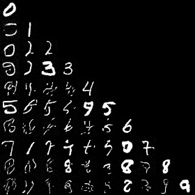
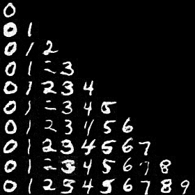

# Variational continuaal learning for diffusion model.

A codespace for training diffusion models with [variational continual learning](https://arxiv.org/abs/1710.10628), to see if it can mitigate catastrophic forgetting.

  <table>
    <tr>
      <td align="center">
        
         
        <em>Standard training.</em>
      </td>
      <td align="center">
        
         
        <em>VCL training.</em>
      </td>
    </tr>
    <tr>
      <td colspan="2" align="center">
        <em>Images generated during continual learning of MNIST digits, with not data replay. Each row i shows generations from when the model had been trained on
            the first i tasks (digits), each column j shows generations for digit j.</em>
      </td>
    </tr>
  </table>

Note that the variational inference for VCL is very expensive, and so this code will take several hours to run on a powerful GPU.
